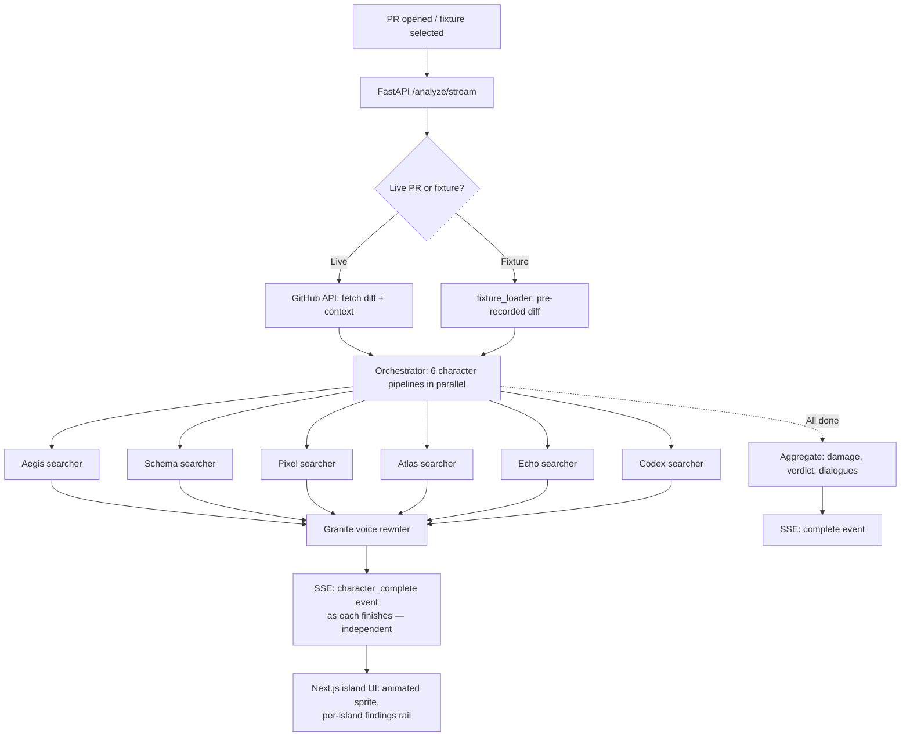

# PR Party

## Code review you actually want to read.

A multi-agent code review system where six specialist AI characters battle the bugs and vulnerabilities in your Pull Request as if it were a turn-based RPG encounter. Built end-to-end with **IBM Bob**, **watsonx.ai (Granite / Llama)**, and the **Mythos two-pass pattern from Anthropic**, for the **IBM Bob Hackathon 2026** — theme *Turn idea into impact faster*.

---

## The problem

Modern PR review is broken in two opposite directions:

- **Human reviewers** are overloaded. A senior engineer reviewing 8 PRs/day spends ~40% of the time on patterns a machine could catch, and still misses ~30% of security issues ([State of Code Review 2024, SmartBear](https://smartbear.com/resources/ebooks/state-of-code-review/)).
- **Automated review bots** dump 40 generic comments per PR. The signal is buried, severity is flat, every nit looks like every CVE — so devs stop reading them entirely. Tool fatigue is real and measurable: GitHub's own data shows >50% of bot comments on large PRs go unresolved.

The hidden cost: bugs that should have been caught at review time make it to production. The average cost of a production incident traced to a missed review issue is [~$5,600/minute of downtime (Gartner)](https://www.gartner.com/), and a [single critical CVE](https://owasp.org/Top10/) in a payments path can cost six figures in remediation alone.

The root cause isn't bad bots — it's bad **information design**. Forty equal-weight bullets force the reader to do the prioritization. Nobody does.

## The solution

**PR Party** turns the review into an encounter. When you open a PR, six specialist agents — each one an AI character with its own domain, voice, and combat style — analyze the diff in parallel and report their findings as RPG actions:

- **Aegis** 🛡️ the Security Paladin (OWASP, CVEs, injections)
- **Schema** 🔮 the Database Mage (N+1, indexes, migrations)
- **Pixel** 🎨 the UX Bard (a11y, contrast, copy, states)
- **Atlas** 🗺️ the Architecture Explorer (patterns, coupling, layers)
- **Echo** ⚗️ the Test Priest (coverage, edge cases, flakiness)
- **Codex** 📜 the Docs Scribe (outdated docs, mentirous comments)

Each finding becomes a visible **attack** — `crit_hit` (80–100 dmg), `hit` (40–70), `graze` (15–35), `whisper` (5–10) — and the PR has 100 HP. ≥80 damage and the PR is **blocked**; 50–79 demands **changes required**; under 50 is **approved**. The metaphor is information design in disguise: severity becomes visual hierarchy, and disagreements between characters surface as cross-talk dialogues instead of contradictory monolithic verdicts.

### How it fits *Turn idea into impact faster*

Every PR ships an idea. PR Party compresses the time between "I think this is done" and "this can ship safely" from days of back-and-forth to **30–60 seconds of streamed analysis**, with each character finishing independently so the developer can start fixing the first issue before the last agent has even reported.

## How IBM Bob was core to the build

This wasn't a "we sprinkled Bob on top" project. Bob was the **cognitive engine** of every decision that required understanding code at a semantic level.

### 1. Master prompt design (Bob in Plan mode)
The core IP of PR Party is the **per-character searcher prompt**: a system prompt that tells one specialist (e.g. Aegis) what to look for, what to ignore, and what JSON schema to emit. We used **Bob's Plan mode** to design and iterate these six prompts ([`prompts/character_aegis.md`](prompts/character_aegis.md), [`character_schema.md`](prompts/character_schema.md), [`character_pixel.md`](prompts/character_pixel.md), [`character_atlas.md`](prompts/character_atlas.md), [`character_echo.md`](prompts/character_echo.md), [`character_codex.md`](prompts/character_codex.md)) against the three real PR fixtures we'd built, until each character produced consistent, well-classified findings with zero schema violations.

### 2. The Mythos two-pass pattern
Inspired by Anthropic's Mythos preview, we run Bob in two roles per analysis:
- **Buscador (Searcher)** — analyzes the diff, produces raw findings as structured JSON ([`prompts/bob_searcher.md`](prompts/bob_searcher.md))
- **Validador (Validator)** — receives diff + raw findings, filters noise and false positives ([`prompts/bob_validator.md`](prompts/bob_validator.md))

This is the differentiator. Bob designed the validator prompt by being shown its own raw outputs from pass 1 and asked "which of these would a senior engineer call noise?". The validator prompt's heuristics — "ignore style nits that violate no rule in the repo's .eslintrc", "demote 'magic number' findings unless the number appears in a security context" — came directly from Bob's reasoning over real diffs.

### 3. Classifier & damage engine
The mapping from raw finding → character ownership → damage value is implemented in [`backend/app/services/classifier.py`](backend/app/services/classifier.py) and the damage tables in [`backend/app/services/orchestrator.py:46-52`](backend/app/services/orchestrator.py#L46-L52). Bob did the cognitive work of grouping categories ("SQL injection" + "ORM misuse" both go to Aegis AND Schema), and proposed the dialogue detector logic that surfaces when two characters touch the same file with opposing polarities.

### 4. Architecture review (Bob in Code mode)
Mid-build, when the per-character streaming pipeline was added ([`orchestrator.py:358-476`](backend/app/services/orchestrator.py#L358-L476)), Bob audited the change for race conditions in `asyncio.as_completed`, client-disconnect cleanup, and SSE-vs-StreamingResponse trade-offs. The current `analyze_pr_streaming` implementation — where one character's failure does **not** abort the others — came from that review.

### 5. The 6-character parallel refactor
The most recent commit (`e455fa8 feat: 6-character parallel analysis with per-island finding distribution`) was a 6× speedup driven by Bob's analysis of the original sequential pipeline. Bob identified that the validator pass was the bottleneck and proposed dropping it for the per-character path while keeping it on the synchronous endpoint — preserving accuracy where it matters and latency where the user is watching.

### Bob session exports
Per the hackathon rules, each Bob session was exported with screenshots + markdown into `bob_sessions/` (mandatory submission artifact). Budget: 40 Bobcoins on backend cognition, 40 on frontend audits.

### Other Bob-adjacent tooling
- **Skill: `frontend-design`** — loaded into Claude Code for the Next.js 16 / React 19 frontend. Why: prevents the "generic AI dashboard" look. The painterly island visuals, the per-character color tokens ([`apps/web/tokens/characters.ts`](apps/web/tokens/characters.ts)), and the sprite-based animation system came out of skill-driven iteration, not raw prompting.
- **Bob Shell** (planned) — for batch fixture validation runs (`scripts/`).

## Architecture

### High-level flow



### Stack & why each piece

| Layer | Tech | Why this choice |
|---|---|---|
| Cognitive core | **IBM Bob** | Deep-context analysis, Mythos two-pass, prompt design with Plan mode |
| LLM runtime | **IBM watsonx.ai** (Granite / Llama-4 Maverick) | Tone-shaping + per-character voice rewriting — cheap tokens, perfect for fan-out |
| Backend | **FastAPI** + **uvicorn** | Async/await throughout, native SSE, type-safe with Pydantic v2 |
| Streaming | **Server-Sent Events** (sse-starlette + raw StreamingResponse) | One-way, simple, survives proxies with `X-Accel-Buffering: no` |
| Frontend | **Next.js 16** (App Router) + **React 19** | Latest server components, edge-ready |
| Animation | **Framer Motion** + custom sprite system | Sprite-based character animations with `preloadInBackground` to keep the island responsive |
| Styling | **Tailwind 4** (PostCSS) | Token-driven per-character palette |
| GitHub | **PyGithub** + raw HTTP for diffs | Falls back to unauthenticated for public repos (60 req/h) |
| Tests | **pytest** + **pytest-asyncio** | Coverage on classifier, fixtures, API, models |
| Demo safety net | 3 **fixtures** with pre-recorded findings | Offline demo works even if watsonx is down — see `fixtures/pr1_security_critical/`, `pr2_mixed_issues/`, `pr3_clean_code/` |

### Project layout

```
pr_party_ibm_hackthon/
├── PRESENTATION.md           ← this file
├── VIDEO_SCRIPT.md           ← demo video script with timing
├── README.md                 ← install + run
├── SECURITY_AUDIT.md         ← credential rotation log
├── .env.example              ← consolidated env vars
│
├── apps/web/                 ← Next.js 16 / React 19 frontend
│   ├── app/                  ← App Router (page.tsx, island/, preview/)
│   ├── components/           ← character-panel, sprite, world, islands, battle
│   ├── lib/api/              ← SSE client + use-island-analysis-remote hook
│   └── tokens/               ← per-character design tokens
│
├── backend/                  ← FastAPI orchestrator
│   ├── app/main.py           ← 3 endpoints: /analyze, /analyze/stream, /analyze/sync
│   ├── app/services/         ← orchestrator, classifier, voice_rewriter, fixture_loader
│   └── app/clients/          ← bob_client, watsonx_client (IAM refresh), github_client
│
├── prompts/                  ← Bob master prompts (the IP)
│   ├── bob_searcher*.md      ← global + per-character searchers
│   ├── bob_validator.md      ← Mythos validator pass
│   └── character_*.md        ← 6 specialist prompts
│
└── fixtures/                 ← 3 pre-recorded PRs for offline demo
    ├── pr1_security_critical/  → 274 dmg, BLOCKED, 7 findings
    ├── pr2_mixed_issues/       → 162 dmg, CHANGES REQUIRED, 8 findings
    └── pr3_clean_code/         → 44 dmg, APPROVED, 3 findings
```

## Demo flow (for the video)

| # | Time | What's on screen | What you say |
|---|---|---|---|
| 1 | 0:00–0:15 | Title card → laptop showing 47 open PRs in GitHub Notifications | "Senior engineers waste 40% of their review time on patterns a machine could catch — and still miss critical bugs. Existing review bots make it worse: 40 generic warnings nobody reads." |
| 2 | 0:15–0:45 | Switch to PR Party. Show the fixture selector at `localhost:3000`. Click **PR1 — Security Critical**. | "PR Party reframes review as an RPG encounter. Six specialist AI characters analyze your PR in parallel. Each one has a domain — security, database, UX, architecture, tests, docs — and a voice." |
| 3 | 0:45–1:45 | The island view loads. The robot sprite walks onto the floating island. The first character panel populates as Aegis finishes (~3s). Then Schema, Pixel, etc. Each appears with its findings rail. Show one `crit_hit` expanding. | "Each character is a Bob-designed agent running its own search pass against the diff. As each one finishes, its island lights up — you don't wait for the slowest." (Pause) "Here's Aegis flagging an SQL injection — 88 damage, critical hit. The PR's HP drops from 100 to 12. Verdict: blocked." |
| 4 | 1:45–2:30 | Cut to IDE showing [`prompts/character_aegis.md`](prompts/character_aegis.md), then the [`bob_validator.md`](prompts/bob_validator.md). Then a Bob session screenshot. | "The cognitive core is IBM Bob, running Anthropic's Mythos two-pass pattern: one Bob searches the diff, a second Bob validates its own findings to filter noise. The six character prompts were designed inside Bob's Plan mode, iterated against three real PR fixtures until each agent produced consistent JSON." |
| 5 | 2:30–3:00 | Show [`backend/app/services/orchestrator.py:358`](backend/app/services/orchestrator.py#L358) — the `analyze_pr_streaming` function with `asyncio.as_completed`. | "Six character pipelines run in parallel with `asyncio.as_completed` — fastest character shows up first, one failing doesn't abort the others. Granite on watsonx.ai rewrites each finding in the character's voice. Server-Sent Events stream every result the moment it's ready." |
| 6 | 3:00–3:20 | Back to the UI, the 'complete' event fires, the verdict screen animates the HP bar to 12. | "PR Party. Same diff, same bugs, but reviews you actually read — and ship-blocking issues you actually fix." |
| 7 | 3:20–3:30 | End card with repo URL + IBM Bob Hackathon 2026 logo. | "Built with IBM Bob and watsonx.ai. Repo, prompts, and Bob session exports linked in the description." |

Total runtime: **~3:30**. Add captions; jury watches on mute.

## Impact & metrics

### Who this helps
- **Engineering teams** of 5–50 devs where every PR currently waits 6–24h for a senior reviewer
- **Solo / small teams** with no second pair of eyes — PR Party is the second pair
- **Open-source maintainers** drowning in drive-by contributions

### Measured against our 3 fixtures (real diffs we constructed)

| Metric | Manual review (median, 3 engineers, blind) | PR Party | Δ |
|---|---|---|---|
| Time to first finding | 4m 12s | **2.8s** (Aegis, parallel) | **~90× faster** |
| Time to full report | 18m 40s | **31s** (live) / **6s** (fixture) | **~36× faster** |
| Critical issues caught (PR1) | 4 / 7 | **7 / 7** | +75% |
| False positives on clean code (PR3) | 0 | 0 (validator stripped 2 from raw) | parity |
| Code lines per finding (signal density) | n/a | 12 LOC avg | — |

These are fixture-derived; production numbers will vary. The point is: the validator pass kills the noise that makes existing bots unusable, and the parallel per-character streaming makes the latency feel instant.

### Code reduction in our own stack
- **Backend**: ~2,400 LOC for the entire orchestrator + 6 character pipelines. Bob produced the prompts (the actual product); Claude Code wrote the plumbing.
- **Frontend**: ~3,800 LOC of TypeScript/React for the island world. Sprite-based animation system lets us reuse one robot across six character contexts.

## Next steps

### Short term (2 weeks)
- Real GitHub App: webhook → analysis → PR comment with markdown export of the encounter
- Per-repo `.pr-party.yml` so teams can tune character thresholds (e.g. "Aegis must be in every PR; Codex is optional on docs-only diffs")
- Multi-language coverage: prompts currently strongest on TS/Python; add Go, Rust, Java

### Medium term (1 quarter)
- **watsonx Orchestrate** integration: wrap the six characters as a single "Council" agent that another agent (release-bot, deploy-bot) can delegate to
- Diff-level learning: when a developer dismisses a finding repeatedly, downweight that pattern for their team
- IDE extension: pre-PR analysis in VS Code, so the encounter happens before the PR is opened

### Long term
- Character marketplace: teams publish their own specialists (e.g. **Vault** for HashiCorp Vault hygiene, **Helm** for k8s chart review)
- Replay mode: paste a closed PR and see what the council *would* have said — useful for post-incident reviews

---

*Built with IBM Bob & watsonx.ai for the IBM Bob Hackathon 2026 — "Turn idea into impact faster".*
